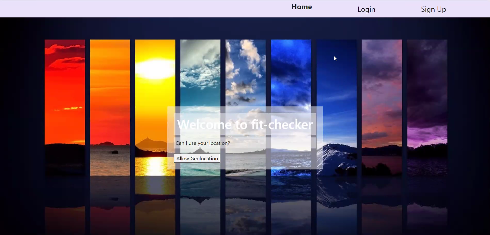
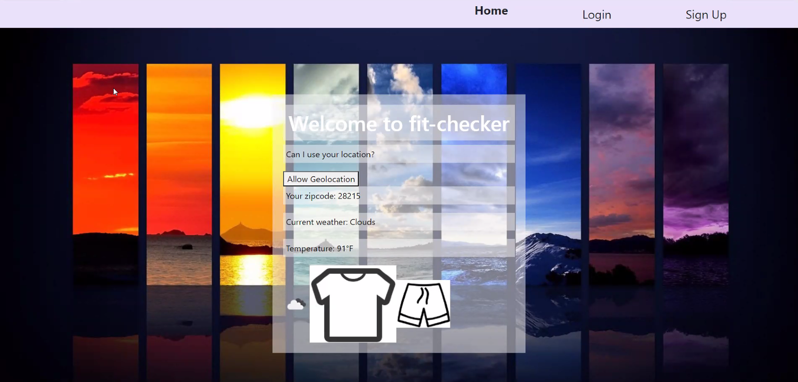

# Fit Checker

## Description

Fit Checker is a collaborative project to select a fit for you based on the weather in your area. It uses https://openweathermap.org/api to request the weather, the built-in API in your browser geolocator to get your location, and https://www.iconfinder.com/search/icons?price=free&q=clothing to fetch the icons for your fit. When you put in your info the API will make the request and display the weather and your fit on the screen. 

## User Story 

As an indecisive person 
I WANT to get an outfit based on the weather 
SO THAT I can quickly get a fit together and go where I need to without being late

## Requirements 

- Use React for the front end
- Use GraphQL with a Node.js and Express.js server
- Use MongoDB and the Mongoose ODM for the database
- Use queries and mutations for retrieving, adding, updating, and deleting data
- Use a polished UI
- Be deployed using Heroku 
- Be interactive 
- Include authentication

## Links to Live Application

To access this project you can click on the link provided that Heroku hosts: 

## Usage 

When you click on the link and load onto the webpage you are brought to the login page where you can sign in if you are a returning user or you can sign up. When you're logged in you are presented with the home page where it will ask you for your location. After you click "Allow Geolocation" it will redirect you to a page with the weather for the day, and your fit based on that weather. 

